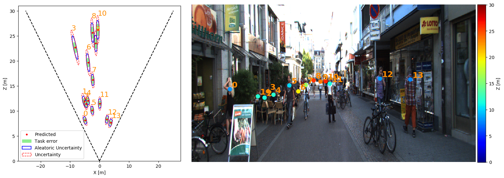
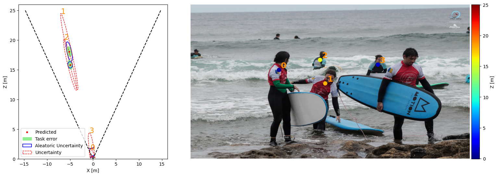
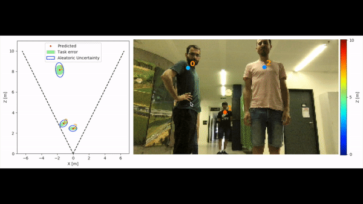
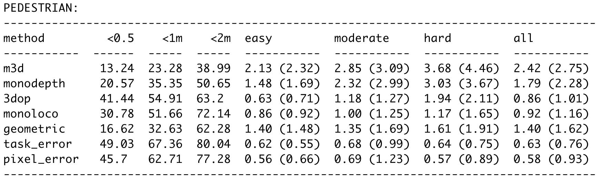

### Short cut

```sh
# preprocessing
python3 -m monoloco.run prep --dir_ann annotations/potenit --dataset potenit

# training
python3 -m monoloco.run train --joints data/arrays/joints-potenit-{your_filename}.json

# eval
python3 -m monoloco.run eval --model {checkpoint path} --generate --dir_ann annotations/potenit --dataset potenit

## submit file
cd data/potenit & zip submit.zip monoloco/*
```

## 베이스라인 설명 동영상  

[](https://youtu.be/CpfK3pPqxNA)


# Monoloco

Monoloco는 단안 RGB 영상으로부터 촬영된 보행자의 3차원 위치 인식에서의 근본적인 원인을 바라보고 해결하고자 합니다. 단순하게 보행자의 위치를 점으로 보고 추정하는 것이 아니라 Laplace distribution를 기반으로 하는 손실 함수를 이용하여 신뢰 구간을 예측함으로써 작업의 모호성을 해결합니다. 저자가 제안하는 아키텍처는 2D Human pose를 입력값으로 사용하여 보행자의 3차원 위치와 이에 해당하는 신뢰 구간을 예측하는 light-weight feed-forward neural network 입니다. 해당 네트워크는 실시간 응용 프로그램에 적합하며, 2019년 당시 KITTI와 nuScenes 데이터 셋에서 SOTA를 달성한 방법론입니다.


# Starter

Docker와 Git에 익숙하지 않으신 분들을 위한 섹션입니다.

### Install Docker 

#### Set up the repository

1. 패키지 인덱스 업데이트 및 설치

```shell
sudo apt-get update
sudo apt-get install \
    ca-certificates \
    curl \
    gnupg \
    lsb-release
```

2. Docker’s official GPG key 추가

```shell
curl -fsSL https://download.docker.com/linux/ubuntu/gpg | sudo gpg --dearmor -o /usr/share/keyrings/docker-archive-keyring.gpg
```

3. Docker 패키지 업데이트

```shell
echo \
  "deb [arch=$(dpkg --print-architecture) signed-by=/usr/share/keyrings/docker-archive-keyring.gpg] https://download.docker.com/linux/ubuntu \
  $(lsb_release -cs) stable" | sudo tee /etc/apt/sources.list.d/docker.list > /dev/null
```

#### Install Docker Engine

1. apt 패키지 업데이트 및 docker 설치

```shell
sudo apt-get update
sudo apt-get install docker-ce docker-ce-cli containerd.io
```

++ Hello world

```shell
sudo docker run hello-world
```

실행 후, 아래와 같이 메세지가 나온다면 정상적으로 docker를 설치하신 겁니다.

> Hello from Docker!
> This message shows that your installation appears to be working correctly.


++ GPU 사용 시, nvidia docker를 추가로 설치하셔야 합니다.

1. Nvidia docker's official GPG key 추가

```shell
distribution=$(. /etc/os-release;echo $ID$VERSION_ID) \
&& curl -s -L https://nvidia.github.io/nvidia-docker/gpgkey | sudo apt-key add - \
&& curl -s -L https://nvidia.github.io/nvidia-docker/$distribution/nvidia-docker.list | sudo tee /etc/apt/sources.list.d/nvidia-docker.list
```

2. 패키지 업데이트 및 nvidia-docker 설치

```shell
sudo apt-get update
sudo apt-get install -y nvidia-docker2
sudo systemctl restart docker
```


### Docker Image

해당 가이드에서는 딥러닝 프레임워크용 도커 이미지 패키지로 유명한 [Deepo](https://github.com/ufoym/deepo)를 활용합니다. 이외에도 다른 이미지들은 [Docker Hub](https://hub.docker.com) 에서 확인 가능합니다.

- 올인원 패키지

```shell
docker pull ufoym/deepo
```

- pytorch 버전

```shell
docker pull ufoym/deepo:pytorch-py36-cu101
```


### Docker usage

1. Run Docker Container

```shell
docker run -it ufoym/deepo bash
```

> 옵션 설명
>
> > -it : -i - interative, -t tts가 결합된 옵션으로 터미널에서 실시간으로 작업을 할 경우, 사용한다.
> > --name : 컨테이너 식별하기 위한 이름 설정
> > -p 호스트와 컨테이너 간의 포트 publish/bind를 위한 옵션. e.g. -p 80:8000
> > -v : 호스트와 컨테이너 간의 volumn 설정을 위한 옵션. 가상 환경을 가진 docker의 특성상 컨테이너가 종료됨과 동시에 누적된 데이터도 함께 삭제되기 때문에 컨테이너 유무와 상관 없이 저장해야 하는 정보들은 volumn을 통해 연동된 저장소에 저장하시기 바랍니다. e.g. -v /raid/datasets 
>
> 예시
>
> ```shell
> docker run -it --name test -v /home:/home -v /datasets:/datasets -p 8888:8888 ufoym/deepo bash
> ```

2. Container 실행

```shell
docker exec -it test bash
```

# Setup

#### Git clone

```shell
git clone https://github.com/xown3197/3D_Pedestrian_Localization_2021ComputerVision.git

cd 3D_Pedestrian_Localization_2021ComputerVision
```

### [Dataset](https://drive.google.com/file/d/1djoCq7N8_B6733nBrNROHqUpLcsJKPrO/view?usp=sharing)


해당 챌린지에서는 위의 그림과 같은 RGB-Thermal 스테레오로 구성된 카메라 시스템에서 촬영된 데이터 셋을 이용합니다.

해당 챌린지에서 RGB-Thermal-RGB 카메라에서 촬영된 영상만 주어집니다. (요청시 오른쪽 Thermal 영상 제공)

데이터는 실내 무인지게차에서 촬영이 진행되었으며, (왼쪽 RGB 카메라 기준) 작업자들에 대한 Bounding Box 정보와 작업자의 가슴을 타겟으로한 깊이 정보가 주어집니다.

데이터 셋 구성:

- RGB-Thermal-RGB 카메라에서 촬영된 각 637장의 영상
- 왼쪽 RGB 기준, KITTI 3D object detection format으로 구성된 작업자의 bbox 정보와 깊이 정보가 담겨진 637개의 txt 파일.

### Data structure

    Data         
    ├── arrays                 
    ├── models
    ├── kitti
    ├── nuscenes
    ├── potenit
    ├── logs


Run the following to create the folders:

```
mkdir data
cd data
mkdir arrays models kitti nuscenes logs potenit
```

#### Dataset Download - potenit

```shell
pip install gdown

cd potenit

gdown https://drive.google.com/u/2/uc?id=1djoCq7N8_B6733nBrNROHqUpLcsJKPrO&export=download

unzip 3D_Localization.zip
```

### Install

Python 3 is required. Python 2 is not supported. 
Do not clone this repository and make sure there is no folder named monoloco in your current directory.

```
pip3 install monoloco
```

For development of the monoloco source code itself, you need to clone this repository and then:

```
pip3 install -e '.[test, prep]'
```

Python 3.6 or 3.7 is required for nuScenes development kit. 
All details for Pifpaf pose detector at [openpifpaf](https://github.com/vita-epfl/openpifpaf).

### Pre-trained Models

* Download a MonoLoco pre-trained model from 
  [Google Drive](https://drive.google.com/open?id=1F7UG1HPXGlDD_qL-AN5cv2Eg-mhdQkwv) and save it in `data/models` 
  (default) or in any folder and call it through the command line option `--model <model path>`
* Pifpaf pre-trained model will be automatically downloaded at the first run. 
  Three standard, pretrained models are available when using the command line option 
  `--checkpoint resnet50`, `--checkpoint resnet101` and `--checkpoint resnet152`.
  Alternatively, you can download a Pifpaf pre-trained model from [openpifpaf](https://github.com/vita-epfl/openpifpaf)
   and call it with `--checkpoint  <pifpaf model path>`


# Interfaces

All the commands are run through a main file called `main.py` using subparsers.
To check all the commands for the parser and the subparsers (including openpifpaf ones) run:

* `python3 -m monoloco.run --help`
* `python3 -m monoloco.run predict --help`
* `python3 -m monoloco.run train --help`
* `python3 -m monoloco.run eval --help`
* `python3 -m monoloco.run prep --help`

or check the file `monoloco/run.py`
              

# Prediction

The predict script receives an image (or an entire folder using glob expressions), 
calls PifPaf for 2d human pose detection over the image
and runs Monoloco for 3d location of the detected poses.
The command `--networks` defines if saving pifpaf outputs, MonoLoco outputs or both.
You can check all commands for Pifpaf at [openpifpaf](https://github.com/vita-epfl/openpifpaf).


Output options include json files and/or visualization of the predictions on the image in *frontal mode*, 
*birds-eye-view mode* or *combined mode* and can be specified with `--output_types`


### Ground truth matching

* In case you provide a ground-truth json file to compare the predictions of MonoLoco,
  the script will match every detection using Intersection over Union metric. 
   The ground truth file can be generated using the subparser `prep` and called with the command `--path_gt`.
   Check preprocess section for more details or download the file from 
   [here](https://drive.google.com/open?id=1F7UG1HPXGlDD_qL-AN5cv2Eg-mhdQkwv).

* In case you don't provide a ground-truth file, the script will look for a predefined path. 
  If it does not find the file, it will generate images
  with all the predictions without ground-truth matching.

Below an example with and without ground-truth matching. They have been created (adding or removing `--path_gt`) with:
`python3 -m monoloco.run predict --glob docs/002282.png --output_types combined --scale 2 
--model data/models/monoloco-190513-1437.pkl --n_dropout 50 --z_max 30`

With ground truth matching (only matching people):


Without ground_truth matching (all the detected people): 


### Images without calibration matrix

To accurately estimate distance, the focal length is necessary. 
However, it is still possible to test Monoloco on images where the calibration matrix is not available. 
Absolute distances are not meaningful but relative distance still are. 
Below an example on a generic image from the web, created with:
`python3 -m monoloco.run predict --glob docs/surf.jpg --output_types combined --model data/models/monoloco-190513-1437.pkl --n_dropout 50 --z_max 25`




# Webcam



MonoLoco can run on personal computers with only CPU and low resolution images (e.g. 256x144) at ~2fps.
It support 3 types of visualizations: `front`, `bird` and `combined`.
Multiple visualizations can be combined in different windows.

The above gif has been obtained running on a Macbook the command:

```pip3 install opencv-python
python3 -m monoloco.run predict --webcam --scale 0.2 --output_types combined --z_max 10 --checkpoint resnet50 --model data/models/monoloco-190513-1437.pkl
```

# Preprocessing

### Datasets


### Annotations to preprocess

MonoLoco is trained using 2D human pose joints. To create them run pifaf over KITTI or nuScenes training images. 
You can create them running the predict script and using `--networks pifpaf`.

### Inputs joints for training

MonoLoco is trained using 2D human pose joints matched with the ground truth location provided by
nuScenes or KITTI Dataset. To create the joints run: `python3 -m monoloco.run prep` specifying:

1. `--dir_ann` annotation directory containing Pifpaf joints of KITTI or nuScenes. 

2. `--dataset` Which dataset to preprocess. For nuscenes, all three versions of the 
   dataset are supported: nuscenes_mini, nuscenes, nuscenes_teaser.

### Ground truth file for evaluation

The preprocessing script also outputs a second json file called **names-<date-time>.json** which provide a dictionary indexed
by the image name to easily access ground truth files for evaluation and prediction purposes.


# Training

Provide the json file containing the preprocess joints as argument. 

As simple as `python3 -m monoloco.run --train --joints <json file path>`

All the hyperparameters options can be checked at `python3 -m monoloco.run train --help`.

### Hyperparameters tuning

```sh
CUDA_VISIBLE_DEVICES=4 python3 -m monoloco.run train --hyp --multiplier 10 --r_seed 1
```

Random search in log space is provided. An example: `python3 -m monoloco.run train --hyp --multiplier 10 --r_seed 1`.
One iteration of the multiplier includes 6 runs.


# Evaluation (KITTI Dataset)

We provide evaluation on KITTI for models trained on nuScenes or KITTI. We compare them with other monocular 
and stereo Baselines: 

[Mono3D](https://www.cs.toronto.edu/~urtasun/publications/chen_etal_cvpr16.pdf), 
[3DOP](https://xiaozhichen.github.io/papers/nips15chen.pdf), 
[MonoDepth](https://arxiv.org/abs/1609.03677) and our 
[Geometrical Baseline](monoloco/eval/geom_baseline.py).

* **Mono3D**: download validation files from [here](http://3dimage.ee.tsinghua.edu.cn/cxz/mono3d) 
  and save them into `data/kitti/m3d`
* **3DOP**: download validation files from [here](https://xiaozhichen.github.io/) 
* **MonoDepth**: compute an average depth for every instance using the following script 
  [here](https://github.com/Parrotlife/pedestrianDepth-baseline/tree/master/MonoDepth-PyTorch) 
  and save them into `data/kitti/monodepth`
* **GeometricalBaseline**: A geometrical baseline comparison is provided. 
  The average geometrical value for comparison can be obtained running:
  `python3 -m monoloco.run eval --geometric 
  --model data/models/monoloco-190719-0923.pkl --joints data/arrays/joints-nuscenes_teaser-190717-1424.json`


The following results are obtained running:
`python3 -m monoloco.run eval --model data/models/monoloco-190719-0923.pkl --generate
--dir_ann <folder containing pifpaf annotations of KITTI images>`





```
@InProceedings{Bertoni_2019_ICCV,
author = {Bertoni, Lorenzo and Kreiss, Sven and Alahi, Alexandre},
title = {MonoLoco: Monocular 3D Pedestrian Localization and Uncertainty Estimation},
booktitle = {The IEEE International Conference on Computer Vision (ICCV)},
month = {October},
year = {2019}
}
```
